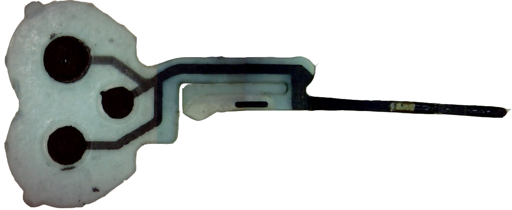

# Freestyle Sensor Libre

Este projeto destina-se a popularizar os estudos na área de monitoramento de Glicose. É usado como base o sensor da empresa FreeStyle. Este sensor tem um custo muito alto no Brasil, já que não há concorrência.
O objetivo aqui não é copiar o sensor para produzir no Brasil e nem violar nenhuma patente. A idéia é apenas que engenheiros brasileiros se interessem por esta área que é muito potencial e devido a falta de concorrência permite que empresas que detem o monopólio não se preocupem distribuir esses produtos de forma mais acessível.

Ao longo do tempo publicarei Esquemáticos, Firmware e métodos para cálculo de Glicóse a partir do Chip [RF430TAL152H](http://www.ti.com/product/RF430FRL152H/technicaldocuments) da Texas através do ADC.

Quem estiver interessado em colaborar entre em contato.

Abaixo segue a descrição do sensor feita pelo fabricante:

## Sensor

O sensor do FreeStyle Libre foi projetado para ser fácil de aplicar e usar. Pequeno e discreto.

IMPORTANTE: O Sistema Flash de Monitoramento FreeStyle Libre é indicado para medir níveis da glicose no fluído intersticial em adultos com 18 anos ou mais.

Como usar o sensor do FreeStyle Libre

#### Aplique o sensor
O sensor do FreeStyle Libre deve ser aplicado na parte posterior superior do braço com um dispositivo simples e descartável chamado "aplicador". Quando o sensor é aplicado, um pequeno filamento estéril e flexível é inserido sob a pele. Ele permanece fixo no local graças a uma camada adesiva.

#### Escaneie o sensor
Para fazer a leitura da glicose, basta escanear o sensor com o leitor – um processo rápido e indolor3 que leva apenas 1 segundo. Essa leitura fornece mais informações do que o monitoramento realizado através de tiras de teste de glicose sanguínea, sem a necessidade das rotineiras picadas no dedo1. O sistema FreeStyle Libre também oferece um software que gera relatórios concisos para auxiliar na análise dos dados da glicose.

#### Faça a leitura
Cada leitura do sensor fornece dados atualizados da glicose, o histórico glicêmico das últimas 8 horas e uma seta de tendência mostrando se a glicose está subindo, baixando ou mudando lentamente. O leitor é capaz de ler o sensor mesmo através da roupa2.

##Hardware

##Fita de Leitura

